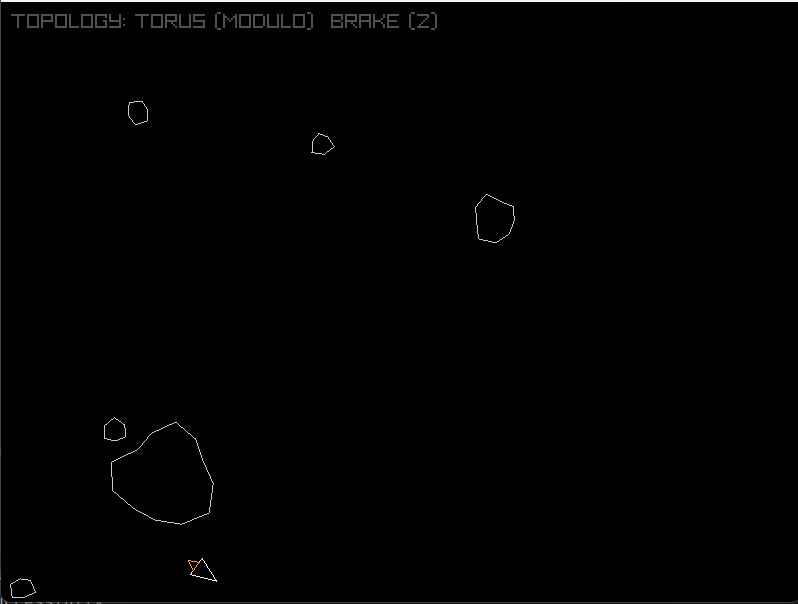

# Lab 06 – Asteroids: Topologia Świata i Proceduralne Obiekty



Rys.1 SS przedstawiający przykładowe działanie gry.

## Co zostało zrealizowane
W ramach laboratorium zaimplementowałem pełną mechanikę poruszania się w przestrzeni toroidalnej (zakrzywionej) oraz system proceduralnego generowania przeszkód. Wszystkie wymagania (1-5) oraz oba zadania dodatkowe zostały w pełni zrealizowane.

### Realizacja Zadań Podstawowych (1-5)
* **Zadanie 1: Zawijanie Świata (Modulo)** – Wprowadziłem metodę `wrap()` w klasach `Ship` i `Asteroid`. Wykorzystuje ona operację modulo `%`, co pozwala na płynne przechodzenie obiektów między krawędziami ekranu (obsługuje zarówno wartości dodatnie, jak i ujemne).
* **Zadanie 2: Klasa Asteroid z Ruchem** – Stworzyłem moduł `asteroid.py`. Asteroidy posiadają wektor prędkości zależny od ich masy (rozmiaru) oraz poruszają się z wykorzystaniem Delta Time, co zapewnia stałą prędkość niezależnie od liczby klatek na sekundę.
* **Zadanie 3 & 4: Renderowanie Widm (Ghost Rendering) i utils.py** – To kluczowy element wizualny. Stworzyłem funkcję `ghost_positions` w pliku `utils.py`. Gdy obiekt przecina krawędź ekranu, jest rysowany jednocześnie w 2 lub 4 miejscach (jeśli znajduje się w rogu). Dzięki temu przejście przez krawędź jest całkowicie płynne dla oka.
* **Zadanie 5: Proceduralne Kształty Asteroid** – Asteroidy nie są już prostymi kołami. Każda z nich generuje listę unikalnych wierzchołków w konstruktorze, tworząc nieregularny wielokąt. Obiekty posiadają własną prędkość obrotową (`rot_speed`), która aktualizuje ich kąt w każdej klatce.

### Realizacja Zadań Dodatkowych (* oraz **)
* **Zadanie *: Separacja Konfiguracji** – Stworzyłem plik `config.py`, który stał się "centralnym punktem prawdy" projektu. Przeniosłem tam wszystkie stałe fizyczne: `SHIP_THRUST`, `FRICTION`, `MAX_SPEED`, a także parametry generowania asteroid. Pozwala to na zmianę balansu gry w jednym miejscu, bez edytowania logiki klas.
* **Zadanie **: Warianty Rozmiarów Asteroid** – Zaimplementowałem system klas rozmiarów: `LARGE`, `MEDIUM`, `SMALL`. Każdy wariant ma w konfiguracji przypisany inny promień, liczbę wierzchołków wielokąta oraz mnożnik prędkości (małe asteroidy są znacznie szybsze i trudniejsze do trafienia).

## Struktura Projektu
* `main.py` – Inicjalizacja okna Raylib i główna pętla gry.
* `ship.py` – Klasa statku: obsługa wejścia, fizyka ciągu, hamulec `Z` oraz rysowanie płomienia.
* `asteroid.py` – Klasa asteroidy: generowanie wielokątów i obsługa różnych rozmiarów.
* `utils.py` – Funkcje pomocnicze dla topologii torusa (obliczanie pozycji widm).
* `config.py` – Wszystkie stałe konfiguracyjne i parametry fizyki.

## Uruchomienie
Aby uruchomić projekt, wymagane jest środowisko Python oraz biblioteka `pyray`:

1.  Instalacja biblioteki:
    ```bash
    pip install raylib-python-cffi
    ```
2.  Uruchomienie gry:
    ```bash
    python main.py
    ```

**Sterowanie:**
* **Strzałka w górę**: Ciąg silnika (aktywuje pomarańczowy płomień).
* **Strzałki lewo/prawo**: Obrót statku.
* **Klawisz Z**: Hamulec awaryjny (gwałtowna redukcja prędkości).

## Refleksja
Największą trudnością było poprawne obsłużenie widm w narożnikach ekranu – wymagało to upewnienia się, że jeśli obiekt jest przesunięty w osi X, to ta nowa pozycja również musi zostać sprawdzona pod kątem przesunięcia w osi Y. Dzięki separacji stałych do `config.py` odkryłem, jak łatwo można zmienić grę z powolnej symulacji w dynamiczną zręcznościówkę, modyfikując zaledwie kilka liczb.
