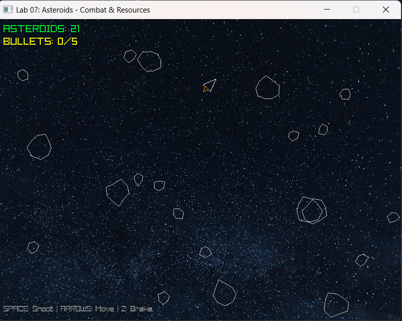

# Lab 07 – Asteroids: Pociski, Zasoby i Kolizje

 Rys.1 Screen przedstawia efekt dzisiejszych zajęć laboratoryjnych.

## Co zostało zrealizowane
W ramach laboratorium rozbudowałem projekt o pełną mechanikę walki, zarządzanie zasobami (audio/grafika) oraz zaawansowany system kolizji. Zrealizowałem wszystkie punkty podstawowe oraz zadania dodatkowe, wzbogacając grę o mechanikę rozpadu obiektów.

### Realizacja zadań:
* **Zadanie 1-2 (Pociski i Strzelanie)**: Wprowadziłem klasę `Bullet` z czasem życia (TTL). Pociski są obsługiwane przez dynamiczną listę, a ich usuwanie odbywa się bezpiecznie przy użyciu *list comprehension*.
* **Zadanie 3 (Zarządzanie Audio)**: Zaimplementowałem pełny cykl życia dźwięków (`shoot.wav` i `explode.wav`). Zasoby są ładowane przed pętlą i poprawnie zwalniane po jej zakończeniu.
* **Zadanie 4 (Tekstura Tła)**: Dodałem obsługę tekstury `stars.png`, która stanowi tło dla wszystkich obiektów gry.
* **Zadanie 5 (Kolizje i Rozpad)**: 
    * Napisałem funkcję sprawdzającą kolizję dwóch okręgów na podstawie odległości euklidesowej.
    * **Mechanika rozpadu**: Zaimplementowałem logikę rozbijania asteroid. Po zestrzeleniu dużej asteroidy powstają dwie średnie, a po zniszczeniu średniej – dwie małe. Zwiększa to liczbę obiektów na ekranie i dynamikę rozgrywki.
* **Zadanie 6 (Animacja Eksplozji)**: Stworzyłem klasę `Explosion`, która generuje efekt wizualny rozszerzającego się i zanikającego pierścienia w miejscu zniszczenia.

### Zadania Dodatkowe (Gwiazdki):
* **Zadanie * (Kolizja Statek–Asteroida)**: Zaimplementowałem wykrywanie zderzeń gracza z asteroidami. Kolizja kończy się eksplozją i resetem pozycji statku na środek ekranu.
* **Zadanie ** (Limit Pocisków)**: Wprowadziłem ograniczenie liczby pocisków (BULLET_LIMIT) jednocześnie znajdujących się na ekranie, co zapobiega "spamowaniu" strzałami.

## Uruchomienie
1.  Upewnij się, że posiadasz bibliotekę `pyray`: `pip install raylib-python-cffi`.
2.  Umieść pliki `stars.png`, `shoot.wav` i `explode.wav` w katalogu `assets/`.
3.  Uruchom grę: `python main.py`.

**Sterowanie:**
* **SPACJA**: Strzał.
* **STRZAŁKI**: Ruch i obrót.
* **Z**: Hamulec.

## Trudności / refleksja
Największą trudnością było poprawne obsłużenie logiki rozpadu asteroid tak, aby nowe obiekty nie pojawiały się "wewnątrz" pocisku, co mogłoby powodować natychmiastową reakcję łańcuchową. Mechanika ta, w połączeniu z systemem kolizji kołowej, sprawiła, że gra stała się znacznie bardziej wymagająca.  