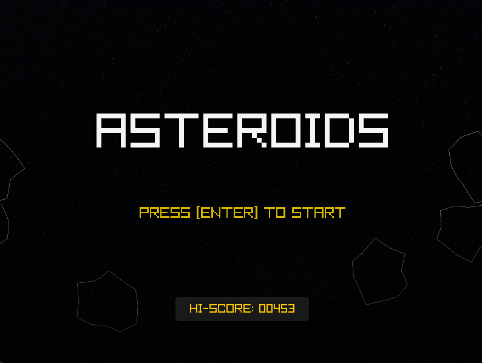
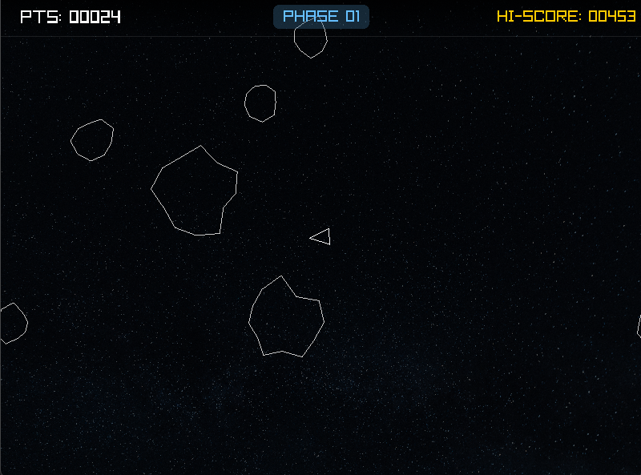
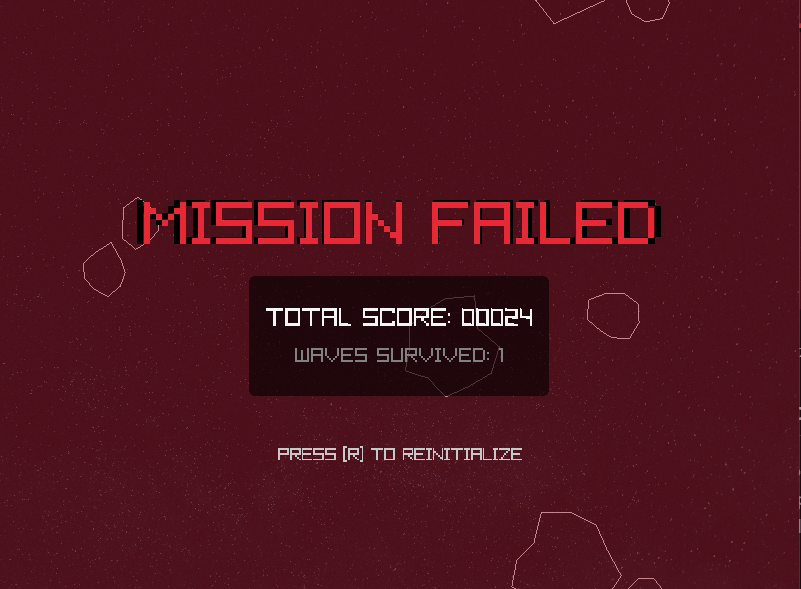

# Lab 08 – Asteroids: FSM, Progresja i Trwałość Danych



 Rys.1 Screen przedstawia menu.

 

 Rys.2 Screen przedstawia gre.

 

 Rys.3 Screen przedstawia menu GAME OVER.

## Co zostało zrealizowane
W ramach tego laboratorium projekt został przekształcony z prostej gry w pełnoprawną aplikację z cyklem życia, systemem rekordów i rosnącym poziomem trudności. Zrealizowane zadania:

* **Zadanie 1: Trzypoziomowe Asteroidy**: Refaktoryzacja klasy `Asteroid`. Obiekty korzystają teraz ze słownika konfiguracji `AST_SIZES`, automatycznie dobierając promień, punkty i prędkość na podstawie klucza (`LARGE`, `MEDIUM`, `SMALL`).
* **Zadanie 2: System Punktacji**: Wprowadzono dynamiczne naliczanie punktów zależne od rozmiaru zniszczonej asteroidy oraz mechanizm śledzenia najlepszego wyniku sesji (`best`).
* **Zadanie 3: Maszyna Stanów (FSM)**: Zaimplementowano profesjonalną architekturę opartą na `enum.Enum` z trzema stanami: `MENU`, `GAME` oraz `GAME_OVER`. Każdy stan posiada odrębną logikę aktualizacji i rysowania.
* **Zadanie 4: Refaktoryzacja (Clean Code)**: 
    * Usunięto "Magic Numbers" – wszystkie parametry znajdują się w `config.py`.
    * Wydzielono logikę do metod w klasie `AsteroidsGame`, unikając długich funkcji.
    * Przeniesiono powtarzalne operacje (np. czyszczenie list, centrowanie tekstu) do `utils.py`.
* **Zadanie 5: Warunki Końca Gry**: Zaimplementowano przejście do stanu `GAME_OVER` po kolizji statku z asteroidą (wraz z efektem eksplozji w miejscu gracza).
* **Zadanie *: System Fal (Progresja)**: Gra nie kończy się po zniszczeniu asteroid. System generuje kolejne, coraz trudniejsze fale z rosnącą liczbą obiektów i bezpiecznym odstępem czasowym (`wave_cooldown`).
* *Zadanie* **: **Zapis Najlepszego Wyniku**: Wprowadzono trwałość danych. Rekord jest zapisywany do pliku `scores.txt` i wczytywany przy starcie gry przy użyciu bezpiecznej obsługi błędów `try/except`.

## Grafika i Interfejs (UI)
Zastosowano nowoczesne podejście do oprawy wizualnej interfejsu:
* **Płynne animacje**: Napisy w menu pulsują przy użyciu funkcji sinus (`math.sin`).
* **Głębia wizualna**: Dodano gradienty, zaokrąglone ramki oraz cienie pod tekstem dla lepszej czytelności na tle gwiazd.
* **HUD**: Profesjonalny pasek stanu wyświetlający punkty, fazę gry (Phase) oraz rekord (Hi-Score).

## Uruchomienie
1.  Wymagana biblioteka: `pip install raylib-python-cffi`.
2.  W folderze `assets/` muszą znajdować się pliki: `stars.png`, `shoot.wav`, `explode.wav`.
3.  Uruchomienie:
    ```bash
    python main.py
    ```

**Sterowanie:**
* **ENTER**: Start gry (w Menu).
* **SPACJA**: Strzał.
* **STRZAŁKI**: Sterowanie statkiem.
* **R**: Powrót do menu (w Game Over).
* **Z**: Hamulec ręczny.

## Trudności / refleksja
Największym wyzwaniem była refaktoryzacja kodu do postaci obiektowej (klasa `AsteroidsGame`). Pozwoliło to jednak wyeliminować problematyczne zmienne globalne i uprościć zarządzanie stanem gry. Wprowadzenie systemu fal wymusiło dodanie mechanizmu "bezpiecznego spawnu", aby nowe asteroidy nie pojawiały się bezpośrednio na graczu. Praca z plikami (`scores.txt`) pokazała, jak istotna jest obsługa wyjątków w celu zapewnienia stabilności aplikacji.