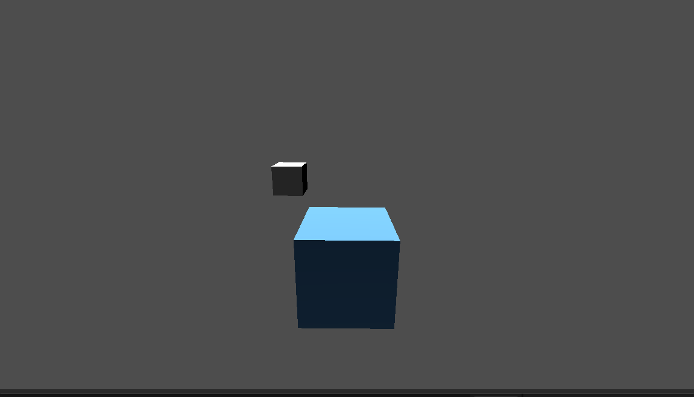

# Laboratorium 09: Rail Shooter Foundation (Godot 4.x)

Pierwszy etap projektu klona gry typu *Star Fox*. Projekt skupia się na implementacji mechaniki "poruszania się po szynie" (on-rails) oraz sterowania statkiem w ograniczonej płaszczyźnie XY.

##  Zrealizowane zadania

W ramach laboratorium zaimplementowano:

1.  **Scena 3D (Zadanie 1)**: Skonfigurowano węzeł główny `Node3D`, oświetlenie `DirectionalLight3D` oraz kamerę `Camera3D`. Jako model statku wykorzystano tymczasowy `MeshInstance3D` (BoxMesh).
2.  **System Szyny (Zadanie 2)**: Utworzono ścieżkę `Path3D` wzdłuż osi Z. Wykorzystano `PathFollow3D` jako rodzica dla kamery i statku, co zapewnia ich synchroniczny ruch.
3.  **Automatyczny postęp (Zadanie 3)**: Napisano skrypt w GDScript, który przesuwa obiekt wzdłuż ścieżki za pomocą właściwości `progress_ratio`. Prędkość została wyeksportowana (`@export`), umożliwiając jej zmianę w inspektorze.
4.  **Sterowanie XY (Zadanie 4)**: Zaimplementowano sterowanie statkiem przy użyciu `Input.get_vector()`. Ruch odbywa się w przestrzeni lokalnej `PathFollow3D`.
5.  **Ograniczenia manewrowania (Zadanie 4)**: Zastosowano funkcję `clamp()`, która blokuje statek przed wylatywaniem poza kadr kamery.
6.  **Zadanie 5: Finalizacja i Porządek :**

Przed wykonaniem commita przeprowadzono kontrolę jakości:
* **Debugowanie**: Sprawdzono konsolę Godot — brak błędów (Errors) i ostrzeżeń (Warnings) dotyczących węzłów 3D lub skryptów.
* **Refaktoryzacja**: Kod został oczyszczony z nieużywanych zmiennych oraz domyślnych komentarzy (`# Replace with function body`).
* **Weryfikacja sterowania**: Potwierdzono, że funkcja `clamp()` skutecznie zatrzymuje statek na krawędziach widoku kamery, uniemożliwiając mu "ucieczkę" z ekranu.
* **Wersjonowanie**: Inicjalizacja repozytorium Git i wykonanie pierwszego commita dokumentującego bazową mechanikę.

##  Sterowanie

- **Strzałki / WASD**: Poruszanie statkiem w płaszczyźnie góra/dół/lewo/prawo.
- **Ruch automatyczny**: Statek samoczynnie podąża wyznaczoną ścieżką `Path3D`.

---
*Projekt wykonany w ramach przedmiotu Tworzenie Gier Komputerowych.*