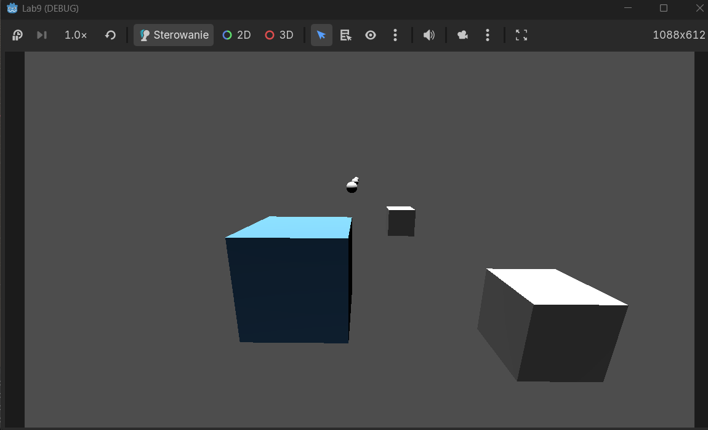

# Lab 10 – Strzelanie i Kolizje 3D

## Co zostało zrealizowane
W ramach laboratorium zaimplementowałem system strzelania oraz mechanizm detekcji trafień w środowisku 3D. Zrealizowałem następujące zadania:

* **Zadanie 1: Scena pocisku** – Stworzyłem scenę `bullet.tscn` (Area3D) z własnym skryptem obsługującym ruch wzdłuż osi `-Z` oraz automatyczne usuwanie obiektu po upływie czasu `lifetime`.
* **Zadanie 2: Hitbox gracza i warstwy kolizji** – Skonfigurowałem `Collision Layers` i `Masks`. Gracz (Layer 1) oraz pocisk (Layer 3) mają ustawioną maskę na warstwę 2 (cele), co zapobiega kolizji pocisku z samym statkiem gracza.
* **Zadanie 3: Mechanika strzelania** – W skrypcie `player.gd` dodałem funkcję instancjonowania pocisków (`bullet_scene.instantiate`). Pociski są dodawane do korzenia drzewa (`get_tree().root`), aby ich ruch był niezależny od ruchu statku po szynie `PathFollow3D`. Zastosowałem cooldown (0.3s) dla strzałów.
* **Zadanie 4: Statyczny cel** – Utworzyłem scenę `target.tscn` (Area3D), która po wykryciu kolizji z pociskiem (`area_entered`) komunikuje się ze skryptem `main.gd` i usuwa się z mapy.
* **Zadanie 5: System punktacji** – W skrypcie `main.gd` zaimplementowałem licznik punktów oraz funkcję `add_score`, która jest wywoływana przez cele w momencie ich zniszczenia. Wynik jest wypisywany w konsoli.

## Uruchomienie
1. Otwórz projekt w **Godot Engine 4.x**.
2. Upewnij się, że plik `bullet.tscn` jest przypisany do zmiennej `Bullet Scene` w inspektorze węzła **Player**.
3. Uruchom scenę główną `main.tscn` (klawisz **F6**).
4. **Sterowanie:**
    * **Strzałki / WSAD:** Poruszanie statkiem.
    * **Spacja / ui_accept:** Strzał.

## Trudności / refleksja
Główną trudnością było poprawne zorientowanie osi pocisku – początkowo strzelał on "do tyłu" ze względu na podwójną negację w wektorze ruchu (`-basis.z * -speed`), co skorygowałem w skrypcie `bullet.gd`. Ważnym odkryciem było zastosowanie `get_tree().current_scene` wewnątrz skryptu celu, co pozwoliło na łatwy dostęp do funkcji punktacji w `main.gd` bez konieczności tworzenia globalnych Singletonów.